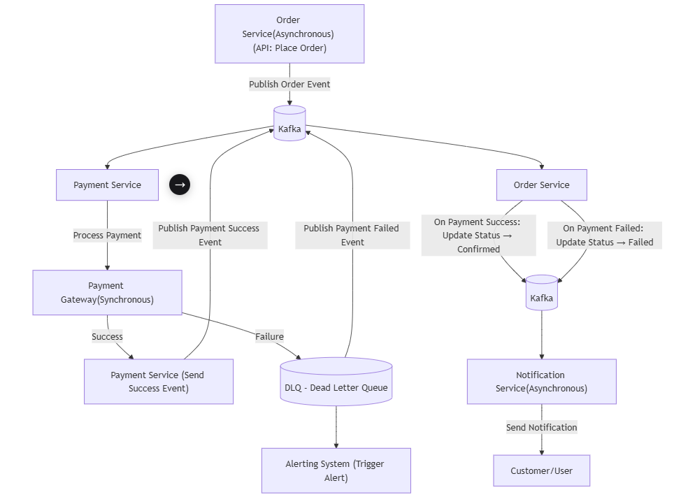

# 🚀 Order Processing System

This repository contains a **scalable and event-driven order processing system** built with **microservices architecture**.  
It leverages **Apache Kafka** for asynchronous communication, integrates with a **Payment Gateway** for synchronous transactions, and ensures **fault tolerance** via **DLQ, monitoring, and alerting**.

---

## 🏗️ Architecture

The system follows an **event-driven architecture** where services communicate asynchronously using Kafka.

<p align="center">
  
</p>

---

## 🔄 Flow Overview

1. 🛒 **Order Service**  
   - Accepts customer orders via an API (`/place-order`)  
   - Publishes an **Order Event** to Kafka  

2. 💳 **Payment Service**  
   - Listens to order events  
   - Processes payments synchronously with the **Payment Gateway**  

3. 🏦 **Payment Gateway**  
   - Handles real-time success/failure responses  

4. 📡 **Event Handling**  
   - ✅ Success → Publishes `PaymentSuccess` event  
   - ❌ Failure → Routed to **DLQ** and publishes `PaymentFailed` event  

5. 📑 **Order Service (Update)**  
   - Consumes `PaymentSuccess` / `PaymentFailed` events  
   - Updates order status (Confirmed / Failed)  

6. 📩 **Notification Service**  
   - Sends notifications to customers asynchronously  

7. 🚨 **Alerting System**  
   - Triggers alerts on DLQ messages  

---

## 🧪 Testing Strategy

- 🧩 **Unit Testing** → Validate service logic independently  
- 🔗 **Integration Testing** → Verify Kafka event flow between services  
- 🛠️ **End-to-End Testing** → Simulate full workflow (Order → Payment → Notification)  

---

## 📊 Monitoring and Alerting

- 📈 Kafka metrics monitored using **Prometheus + Grafana** dashboards  
- 📂 **DLQ** monitored for failed events  
- 📬 Alerts triggered to **Email** on DLQ events, and having future scope of Integration with Service Now.  
- 💓 Service health checks exposed via `/actuator/health`  

---

## 🌐 Distributed Tracing

- 🛰️ Implemented using **Zipkin / Jaeger**  
- 🧾 Each Kafka event carries **correlation IDs** for traceability  
- 🔍 Enables **root-cause analysis** across microservices  

---

## 🛠️ Tech Stack

- ☕ Java / Spring Boot  
- 🔄 Apache Kafka  
- 🌐 REST APIs (Spring MVC)  
- 📊 Prometheus + Grafana (Monitoring)  
- 🛰️ Zipkin  (Distributed Tracing)  
- 🐳 Docker (Deployment)  

---

## ⚙️ Setup Instructions

1. Clone the repository  
   ```bash
   git clone https://github.com/your-username/order-processing-system.git
   cd order-processing-system
   
2. Start your docker locally
   ```bash
    docker-compose up -d

3. Verify running containers
   ```bash
   docker ps
  Check:  
   You will get these containers
 - Kafka
 - Zookeeper
 - Order Service
 - Payment Service
 - Notification Service
 -  Zipkin

4. Access the Service
  - Order Service : http://localhost:8081
  - Payment Service: http://localhost:8087
  - Notification Service: http://localhost:8082

---
## 🎥 Project Demo Videos

- **Order Payment Service Kafka Flow**  
  [](https://youtu.be/VjM5QbM00vE)  

- **Order Payment Monitoring with Grafana & Zipkin**  
  [](https://youtu.be/F4k59Xe-Im8)

## License
 This project under MIT License.


